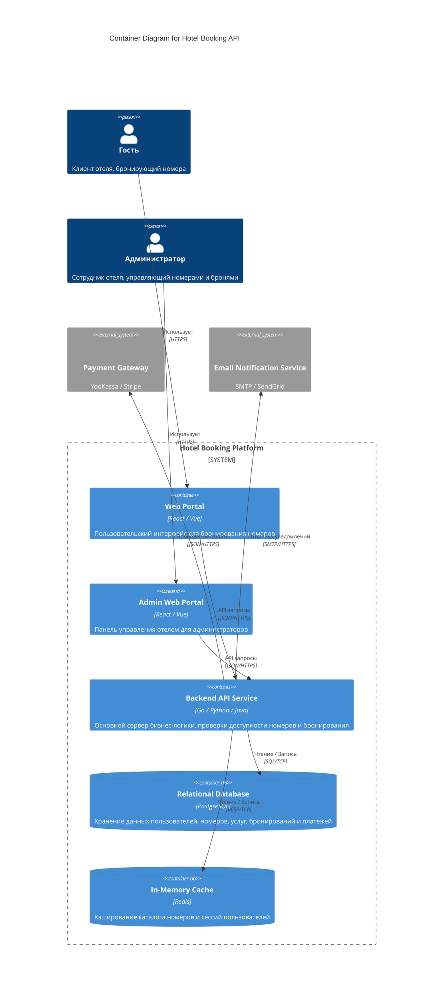
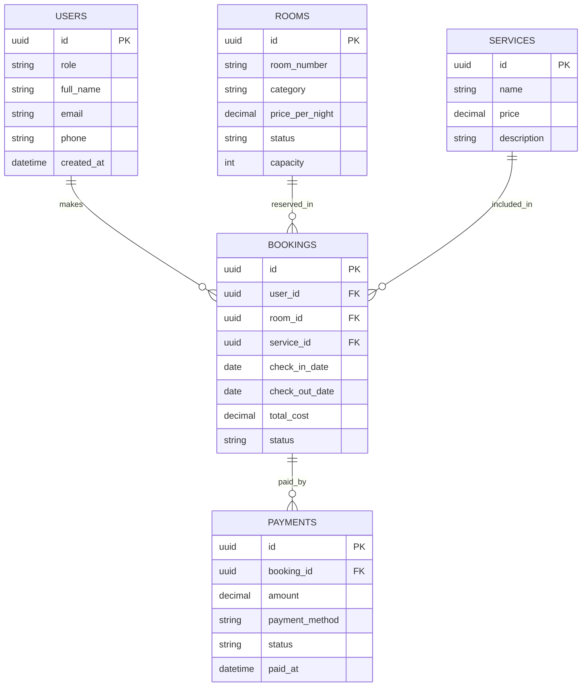

# Архитектура сервиса бронирования номеров отеля (Hotel Booking API)

## Описание проекта
Бэкенд-сервис для системы бронирования номеров в отеле. Приложение обеспечивает поиск и бронирование номеров гостями, выбор дополнительных услуг (завтрак, трансфер, СПА), а также управление фондом номеров и бронированиями со стороны администраторов отеля.

## Ролевая модель и Use Cases

### Гость (Guest)
- Регистрация и аутентификация в системе
- Поиск свободных номеров на выбранные даты
- Бронирование номера с выбором дополнительных услуг
- Оплата бронирования
- Просмотр истории своих бронирований и отмена брони

### Администратор отеля (Hotel Admin)
- Добавление и редактирование номеров (цена, категория, статус)
- Изменение статуса номеров (доступен, занят, на обслуживании)
- Просмотр и управление всеми бронированиями гостей
- Добавление и редактирование дополнительных услуг
- Мониторинг платежей и отчетов

## Диаграмма C4 Container (Уровень 2)

## ER-диаграмма базы данных (3NF)

### Структура таблиц и ограничений

1. **USERS (Пользователи)**
   - `id` (UUID, Primary Key) — уникальный идентификатор.
   - `role` (VARCHAR, NOT NULL) — роль в системе (GUEST, ADMIN).
   - `full_name` (VARCHAR, NOT NULL) — ФИО пользователя.
   - `email` (VARCHAR, UNIQUE, NOT NULL) — email для входа и уведомлений.
   - `phone` (VARCHAR, UNIQUE, NOT NULL) — контактный телефон.
   - Индексы: `email`, `phone`.

2. **ROOMS (Номера отеля)**
   - `id` (UUID, Primary Key) — уникальный идентификатор номера.
   - `room_number` (VARCHAR, UNIQUE, NOT NULL) — номер комнаты (например, "304").
   - `category` (VARCHAR, NOT NULL) — категория (STANDARD, LUXE, SUITE).
   - `price_per_night` (DECIMAL, CHECK(price_per_night > 0), NOT NULL) — цена за одну ночь.
   - `status` (VARCHAR, NOT NULL) — статус номера (AVAILABLE, OCCUPIED, MAINTENANCE).
   - `capacity` (INT, CHECK(capacity > 0), NOT NULL) — вместимость (кол-во гостей).
   - Индексы: `status`, `category`.

3. **SERVICES (Дополнительные услуги)**
   - `id` (UUID, Primary Key) — уникальный идентификатор услуги.
   - `name` (VARCHAR, UNIQUE, NOT NULL) — название услуги (Завтрак, Трансфер, СПА).
   - `price` (DECIMAL, CHECK(price >= 0), NOT NULL) — стоимость услуги.
   - `description` (TEXT) — описание услуги.

4. **BOOKINGS (Бронирования)**
   - `id` (UUID, Primary Key) — уникальный идентификатор брони.
   - `user_id` (UUID, Foreign Key -> USERS.id, NOT NULL) — кто забронировал.
   - `room_id` (UUID, Foreign Key -> ROOMS.id, NOT NULL) — забронированный номер.
   - `service_id` (UUID, Foreign Key -> SERVICES.id, NULLable) — выбранная доп. услуга.
   - `check_in_date` (DATE, NOT NULL) — дата заезда.
   - `check_out_date` (DATE, CHECK(check_out_date > check_in_date), NOT NULL) — дата выезда.
   - `total_cost` (DECIMAL, CHECK(total_cost >= 0), NOT NULL) — итоговая стоимость бронирования.
   - `status` (VARCHAR, NOT NULL) — статус брони (PENDING, CONFIRMED, CANCELED).
   - Индексы: `user_id`, `room_id`, `check_in_date`, `check_out_date`.

5. **PAYMENTS (Платежи)**
   - `id` (UUID, Primary Key) — уникальный идентификатор платежа.
   - `booking_id` (UUID, Foreign Key -> BOOKINGS.id, NOT NULL) — привязка к бронированию.
   - `amount` (DECIMAL, CHECK(amount > 0), NOT NULL) — сумма платежа.
   - `payment_method` (VARCHAR, NOT NULL) — способ оплаты (CARD, CASH).
   - `status` (VARCHAR, NOT NULL) — статус оплаты (PENDING, COMPLETED, REFUNDED).
   - `paid_at` (TIMESTAMP) — время проведения оплаты.
   - Индексы: `booking_id`.
