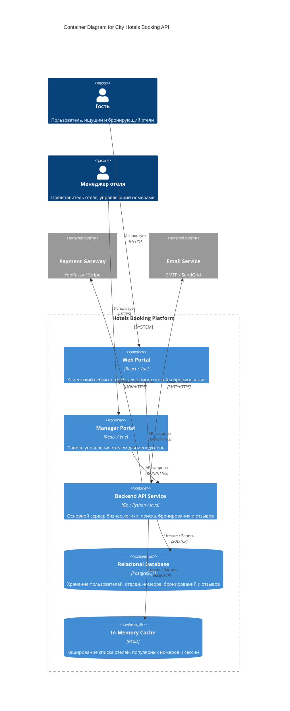
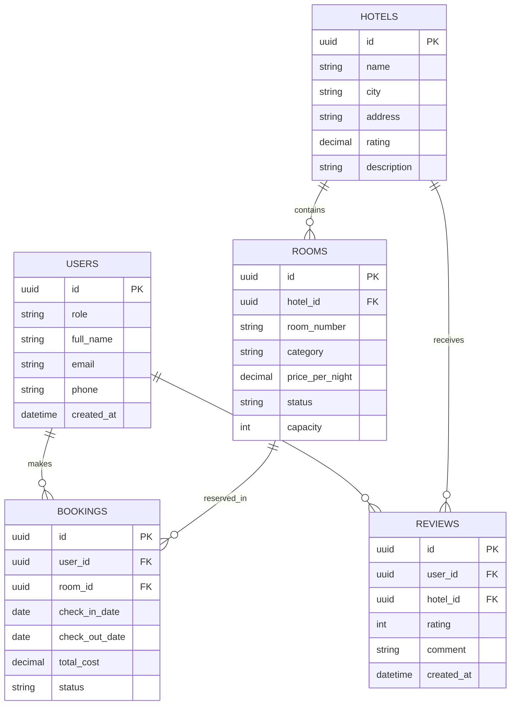

# Архитектура сервиса бронирования отелей (City Hotels Booking API)

## Описание проекта
Бэкенд-платформа для поиска и бронирования отелей (агрегатор отелей города, например, отелей Симферополя). Система позволяет пользователям находить отели, просматривать доступные номера, бронировать проживание и оставлять отзывы, а владельцам/менеджерам отелей — регистрировать свои отели, управлять номерами и отслеживать бронирования.

## Ролевая модель и Use Cases

### Гость (Guest)
- Регистрация и аутентификация в системе
- Поиск отелей и свободных номеров на выбранные даты
- Фильтрация номеров по цене, категории и рейтингу отеля
- Бронирование выбранного номера
- Просмотр истории своих бронирований и отмена брони
- Оставление отзывов и оценок отелям после проживания

### Менеджер отеля (Hotel Manager)
- Регистрация своего отеля в системе (название, адрес, описание)
- Управление фондом номеров (добавление комнат, изменение цен и категорий)
- Изменение статусов номеров (свободен, занят, ремонт)
- Просмотр списка бронирований своего отеля
- Просмотр отзывов гостей

## Диаграмма C4 Container (Уровень 2)

## ER-диаграмма базы данных (3NF)

### Структура таблиц и ограничений

1. **USERS (Пользователи)**
   - `id` (UUID, Primary Key) — уникальный идентификатор.
   - `role` (VARCHAR, NOT NULL) — роль в системе (GUEST, MANAGER).
   - `full_name` (VARCHAR, NOT NULL) — ФИО пользователя.
   - `email` (VARCHAR, UNIQUE, NOT NULL) — email для входа и уведомлений.
   - `phone` (VARCHAR, UNIQUE, NOT NULL) — контактный телефон.
   - Индексы: `email`, `phone`.

2. **HOTELS (Отели)**
   - `id` (UUID, Primary Key) — уникальный идентификатор отеля.
   - `name` (VARCHAR, NOT NULL) — название отеля.
   - `city` (VARCHAR, NOT NULL) — город (например, "Симферополь").
   - `address` (VARCHAR, NOT NULL) — точный адрес.
   - `rating` (DECIMAL, CHECK(rating >= 0 AND rating <= 5)) — средний рейтинг отеля.
   - `description` (TEXT) — описание отеля.
   - Индексы: `city`, `rating`.

3. **ROOMS (Номера отелей)**
   - `id` (UUID, Primary Key) — уникальный идентификатор номера.
   - `hotel_id` (UUID, Foreign Key -> HOTELS.id, NOT NULL) — привязка к отелю.
   - `room_number` (VARCHAR, NOT NULL) — номер комнаты.
   - `category` (VARCHAR, NOT NULL) — категория (STANDARD, LUXE, SUITE).
   - `price_per_night` (DECIMAL, CHECK(price_per_night > 0), NOT NULL) — цена за ночь.
   - `status` (VARCHAR, NOT NULL) — статус (AVAILABLE, OCCUPIED, MAINTENANCE).
   - `capacity` (INT, CHECK(capacity > 0), NOT NULL) — вместимость (кол-во гостей).
   - Индексы: `hotel_id`, `status`, `price_per_night`.

4. **BOOKINGS (Бронирования)**
   - `id` (UUID, Primary Key) — уникальный идентификатор брони.
   - `user_id` (UUID, Foreign Key -> USERS.id, NOT NULL) — кто забронировал.
   - `room_id` (UUID, Foreign Key -> ROOMS.id, NOT NULL) — забронированный номер.
   - `check_in_date` (DATE, NOT NULL) — дата заезда.
   - `check_out_date` (DATE, CHECK(check_out_date > check_in_date), NOT NULL) — дата выезда.
   - `total_cost` (DECIMAL, CHECK(total_cost >= 0), NOT NULL) — итоговая стоимость.
   - `status` (VARCHAR, NOT NULL) — статус брони (PENDING, CONFIRMED, CANCELED).
   - Индексы: `user_id`, `room_id`, `check_in_date`, `check_out_date`.

5. **REVIEWS (Отзывы)**
   - `id` (UUID, Primary Key) — уникальный идентификатор отзыва.
   - `user_id` (UUID, Foreign Key -> USERS.id, NOT NULL) — автор отзыва.
   - `hotel_id` (UUID, Foreign Key -> HOTELS.id, NOT NULL) — отель, которому оставлен отзыв.
   - `rating` (INT, CHECK(rating >= 1 AND rating <= 5), NOT NULL) — оценка от 1 до 5.
   - `comment` (TEXT) — текст отзыва.
   - `created_at` (TIMESTAMP) — дата публикации отзыва.
   - Индексы: `hotel_id`, `user_id`.
