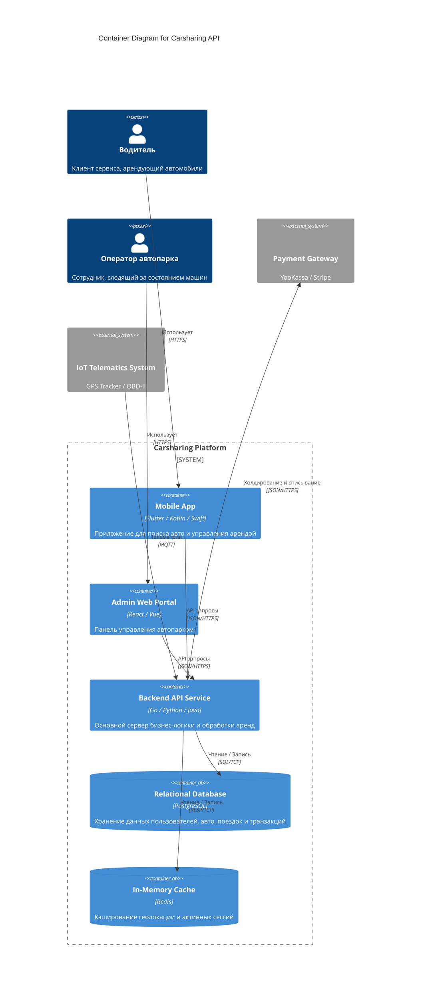
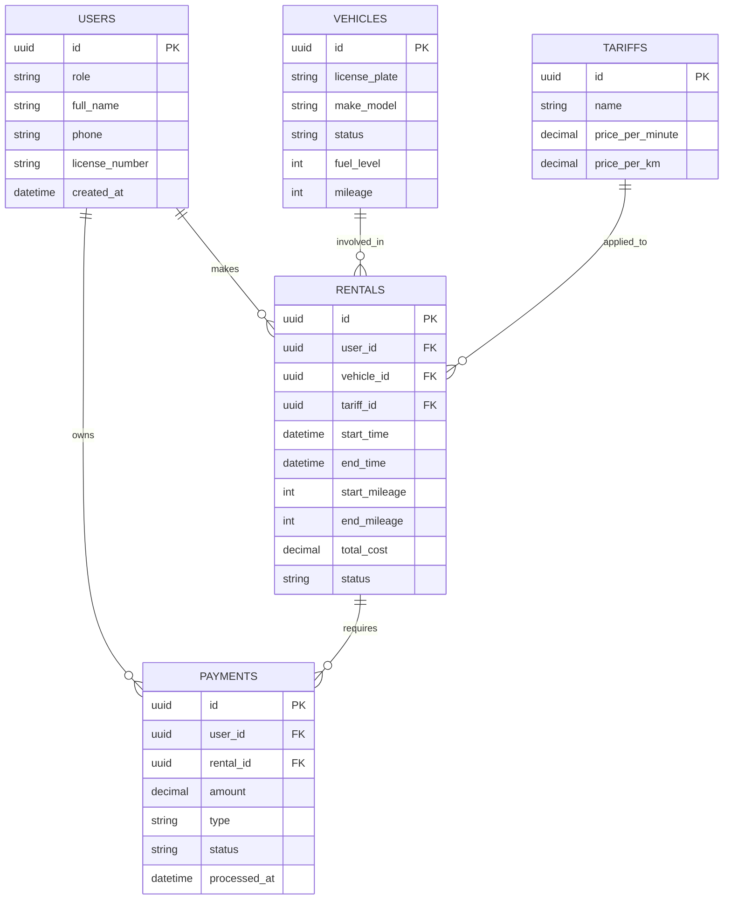

# Архитектура сервиса аренды автомобилей (Carsharing API)

## Описание проекта
Бэкенд-сервис для системы каршеринга. Приложение обеспечивает поиск, бронирование и аренду автомобилей пользователями, а также управление автопарком со стороны операторов. Реализован учет пробега и уровня топлива, отслеживание доступности авто и заморозка (холдирование) депозита на карте клиента.

## Ролевая модель и Use Cases

### Водитель
- Регистрация и аутентификация
- Поиск свободных автомобилей на карте
- Бронирование и старт аренды
- Завершение аренды и расчет стоимости
- Просмотр истории поездок

### Оператор автопарка
- Добавление и редактирование автомобилей
- Изменение статусов авто (доступен, в ремонте, заблокирован)
- Мониторинг пробега, уровня топлива и текущих координат
- Просмотр общей статистики поездок
- Управление тарифами

## Диаграмма C4 Container (Уровень 2)

## ER-диаграмма базы данных (3NF)

### Структура таблиц и ограничений

1. **USERS**
   - `id` (UUID, PK) — идентификатор пользователя.
   - `role` (VARCHAR, NOT NULL) — роль в системе (DRIVER, OPERATOR).
   - `phone` (VARCHAR, UNIQUE, NOT NULL) — телефон.
   - `license_number` (VARCHAR, UNIQUE) — номер водительского удостоверения.
   - Индексы: `phone`, `license_number`.

2. **VEHICLES**
   - `id` (UUID, PK) — идентификатор автомобиля.
   - `license_plate` (VARCHAR, UNIQUE, NOT NULL) — регистрационный номер.
   - `status` (VARCHAR, NOT NULL) — текущий статус (AVAILABLE, IN_USE, MAINTENANCE).
   - `fuel_level` (INT, CHECK(fuel_level >= 0 AND fuel_level <= 100)) — процент топлива.
   - `mileage` (INT, CHECK(mileage >= 0)) — пробег в километрах.
   - Индексы: `status`.

3. **TARIFFS**
   - `id` (UUID, PK) — идентификатор тарифа.
   - `name` (VARCHAR, UNIQUE, NOT NULL) — название тарифа.
   - `price_per_minute` (DECIMAL, NOT NULL) — стоимость минуты аренды.
   - `price_per_km` (DECIMAL, NOT NULL) — стоимость километра пробега.

4. **RENTALS**
   - `id` (UUID, PK) — идентификатор аренды.
   - `user_id` (UUID, FK -> USERS.id, NOT NULL) — арендатор.
   - `vehicle_id` (UUID, FK -> VEHICLES.id, NOT NULL) — автомобиль.
   - `tariff_id` (UUID, FK -> TARIFFS.id, NOT NULL) — применяемый тариф.
   - `status` (VARCHAR, NOT NULL) — состояние аренды (ACTIVE, COMPLETED, CANCELED).
   - Индексы: `user_id`, `vehicle_id`.

5. **PAYMENTS**
   - `id` (UUID, PK) — идентификатор транзакции.
   - `user_id` (UUID, FK -> USERS.id, NOT NULL) — плательщик.
   - `rental_id` (UUID, FK -> RENTALS.id, NULLable) — связанная аренда.
   - `type` (VARCHAR, NOT NULL) — тип операции (DEPOSIT, PAYMENT, REFUND).
   - `status` (VARCHAR, NOT NULL) — статус транзакции (PENDING, SUCCESS, FAILED).
   - Индексы: `rental_id`.
